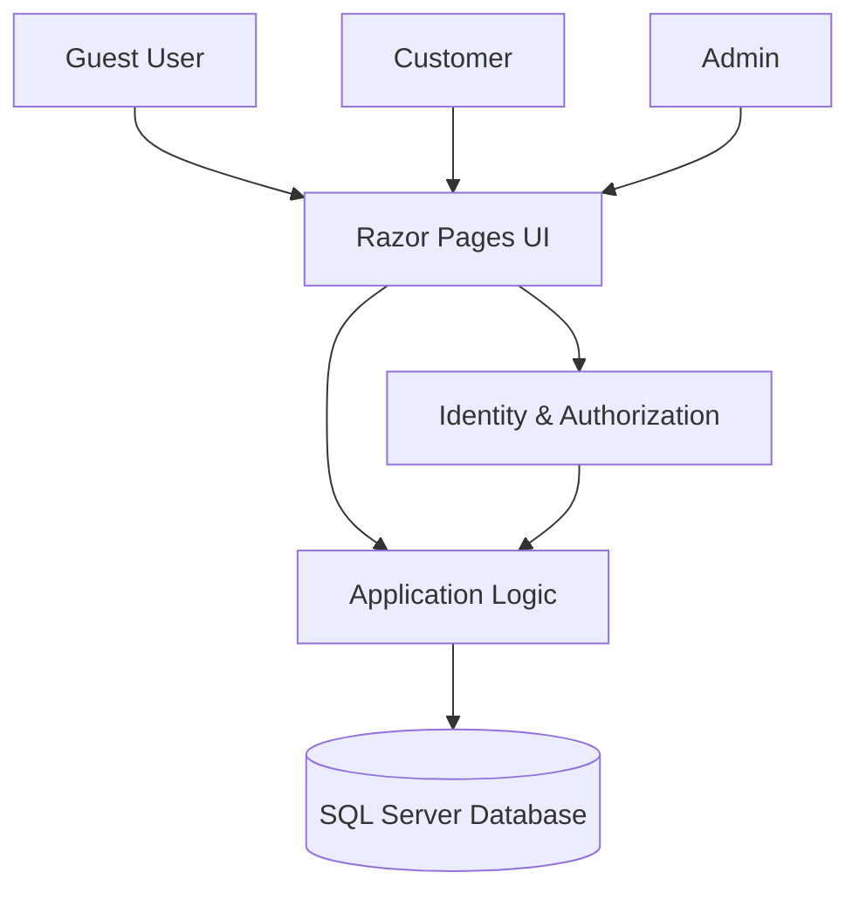
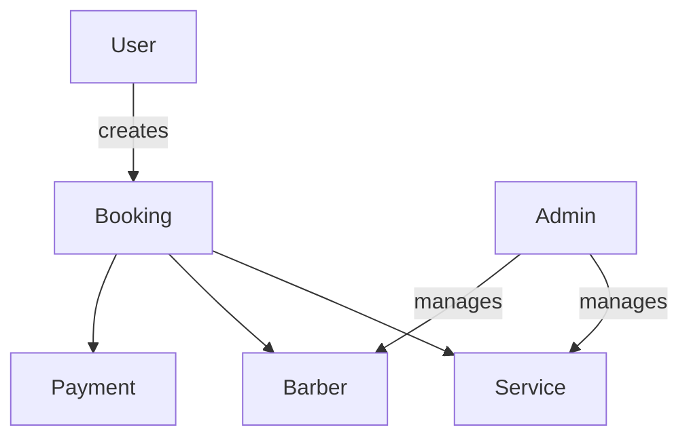
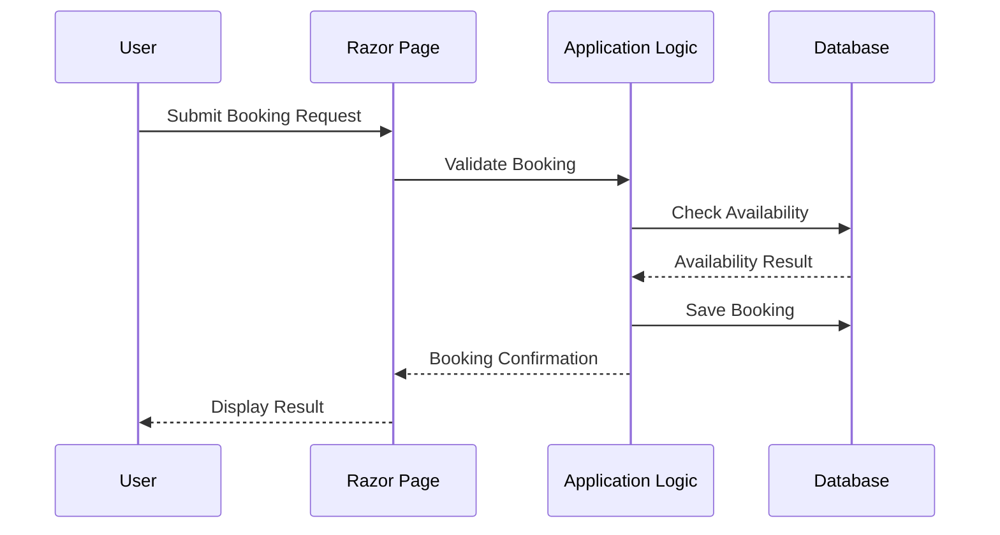

# Salon Management System – Architecture

## 1. System Overview
The Salon Management System is a web-based application designed to streamline salon operations and customer bookings. The system allows customers to browse services and book appointments online, while administrators manage services, bookings, barbers, and overall system operations. The primary goal is to eliminate long waiting times, prevent scheduling conflicts, and improve operational efficiency for both customers and barbers.

---

## 2. Architectural Style
The system follows a **Layered Architecture** implemented using **ASP.NET Core Razor Pages**. This approach separates concerns, improves maintainability, and supports future scalability.

Primary architectural characteristics:
- Server-side rendered web application
- Role-based access control (RBAC)
- Centralized authentication and authorization using ASP.NET Core Identity
- Relational data persistence using SQL Server

---

## 3. High-Level System Architecture



---

## 4. Layered Architecture

```mermaid
graph TD
    Presentation[Presentation Layer\n(Razor Pages)]
    Application[Application Layer\n(Page Models, Business Rules)]
    Infrastructure[Infrastructure Layer\n(EF Core, Identity)]
    Data[Data Layer\n(SQL Server)]

    Presentation --> Application
    Application --> Infrastructure
    Infrastructure --> Data
```

### 4.1 Presentation Layer
- Razor Pages (.cshtml)
- Page Models (.cshtml.cs)
- Handles HTTP requests and responses
- Performs role-based UI rendering (e.g., Admin navigation visibility)

### 4.2 Application Layer
- Contains business logic
- Validates bookings and schedules
- Enforces use-case rules (booking lifecycle, approvals, cancellations)

### 4.3 Infrastructure Layer
- Entity Framework Core
- ASP.NET Core Identity
- Database access and identity management

### 4.4 Data Layer
- SQL Server (LocalDB)
- Stores users, roles, bookings, services, barbers, and payments

---

## 5. Core Components

### 5.1 Authentication & Authorization
- ASP.NET Core Identity (Individual Accounts)
- Role-based access control: Guest, Customer, Admin
- Authentication required for bookings and administrative actions

### 5.2 Booking Management
- Appointment creation by customers
- Admin approval and cancellation
- Schedule conflict prevention

### 5.3 Service Management
- Admin-managed service catalog
- Public service visibility

### 5.4 Barber Management
- Admin manages barber profiles and availability
- Barbers associated with bookings

### 5.5 Payment Handling
- Online payment processing (partial implementation)
- Booking completion tied to payment status

---

## 6. Conceptual Entity Relationship Overview



---

## 7. Request Lifecycle (Component Interaction Flow)



---

## 8. Security Architecture
- Authentication enforced for protected actions
- Role-based authorization for Admin functionality
- Strong password and identity policies
- No credentials stored in source code

---

## 9. Scalability and Performance Considerations
- Stateless web application design
- Database-driven persistence
- Architecture supports future migration to cloud hosting
- Separation of concerns enables horizontal scaling

---

## 10. Technology Mapping

| Concern | Technology |
|------|-----------|
| UI | ASP.NET Core Razor Pages 9.0 |
| ORM | Entity Framework Core 9.0 |
| Authentication | ASP.NET Core Identity |
| Database | SQL Server LocalDB |
| Hosting | Local (planned production) |

---

## 11. Future Architectural Enhancements
- API layer for mobile clients
- Caching for high-traffic services
- External payment gateway integration
- Audit logging and monitoring

  