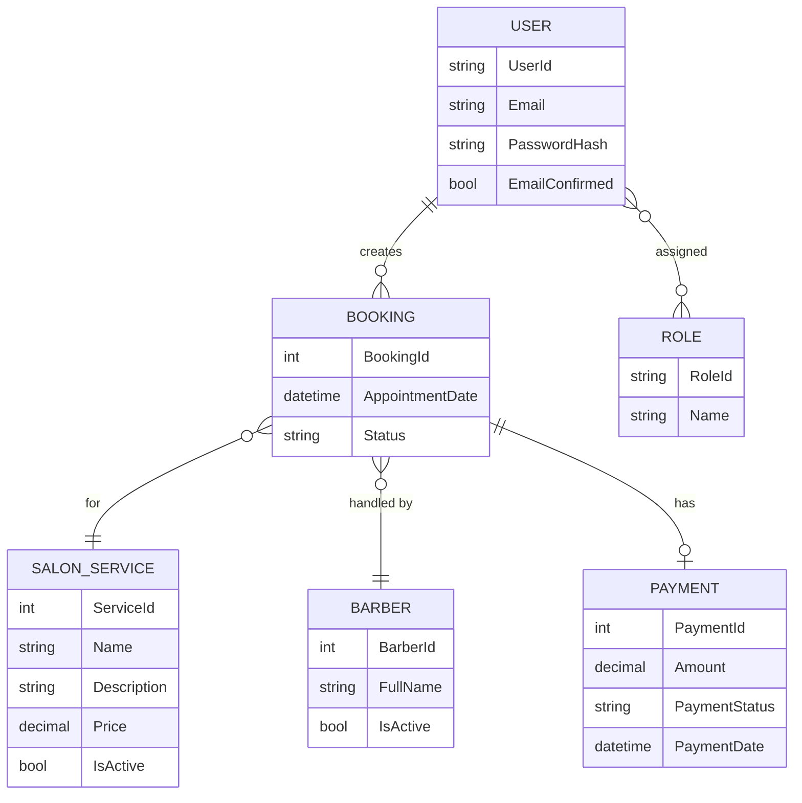

# Salon Management System – Data Model

## 1. Purpose
This document defines the **logical data model** for the Salon Management System. It describes the core entities, their attributes, and relationships at a conceptual level. This is **not** a database schema and intentionally avoids Entity Framework or SQL-specific details.

The goal is to clearly communicate how data is structured and how business concepts relate to one another.

---

## 2. Core Entities Overview

The system is centered around the following primary entities:
- User
- Role
- SalonService
- Barber
- Booking
- Payment

These entities support booking workflows, role-based access control, and administrative management.

---

## 3. Entity Relationship Diagram (Conceptual)

---

## 4. Entity Descriptions

### 4.1 User
Represents an authenticated system user. A user may act as a Customer or an Admin depending on assigned roles.

**Key Responsibilities:**
- Authenticate into the system
- Create and manage bookings (Customer)
- Manage system data (Admin)

---

### 4.2 Role
Defines authorization levels within the system.

**Examples:**
- Admin
- Customer

A user may be associated with one or more roles.

---

### 4.3 SalonService
Represents a service offered by the salon (e.g., haircut, shave).

**Key Responsibilities:**
- Provide service options for bookings
- Define pricing and availability status

---

### 4.4 Barber
Represents a barber or staff member who performs services.

**Key Responsibilities:**
- Be assigned to bookings
- Maintain availability and active status

---

### 4.5 Booking
Represents an appointment created by a customer.

**Key Responsibilities:**
- Link customer, service, barber, and schedule
- Track booking lifecycle (pending, approved, cancelled)

---

### 4.6 Payment
Represents a financial transaction associated with a booking.

**Key Responsibilities:**
- Record payment amount and status
- Confirm booking completion

---

## 5. Relationship Summary

- A **User** can create multiple **Bookings**
- A **Booking** is associated with exactly one **SalonService**
- A **Booking** is assigned to one **Barber**
- A **Booking** may have one associated **Payment**
- **Users** are assigned one or more **Roles** for access control

---

## 6. Design Notes
- The model supports role-based access without duplicating user data
- Booking is the central transactional entity
- Payments are separated to allow future integration with external gateways
- The structure supports scalability and future feature expansion

---

## 7. Future Data Model Extensions
- Barber availability schedules
- Service categories
- Refund records
- Audit logs for admin actions

